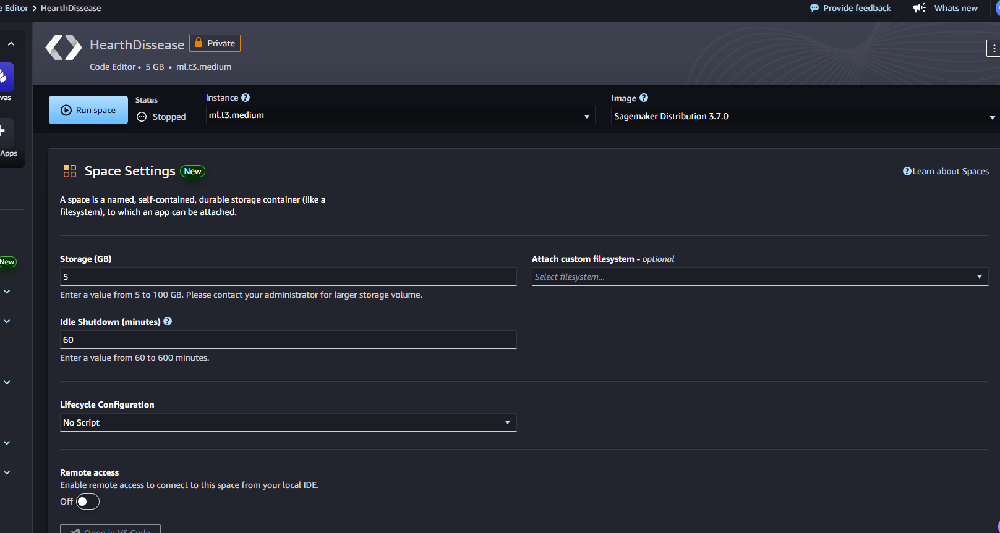
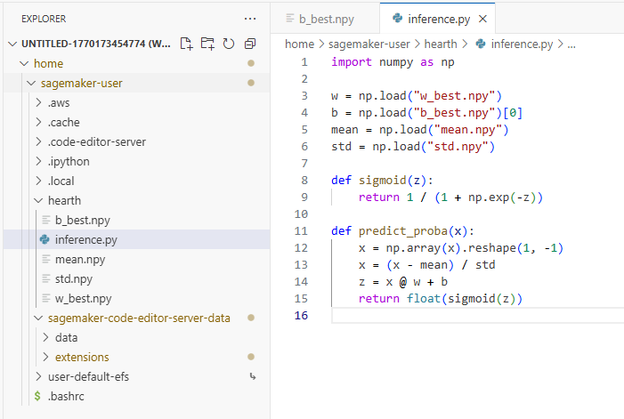
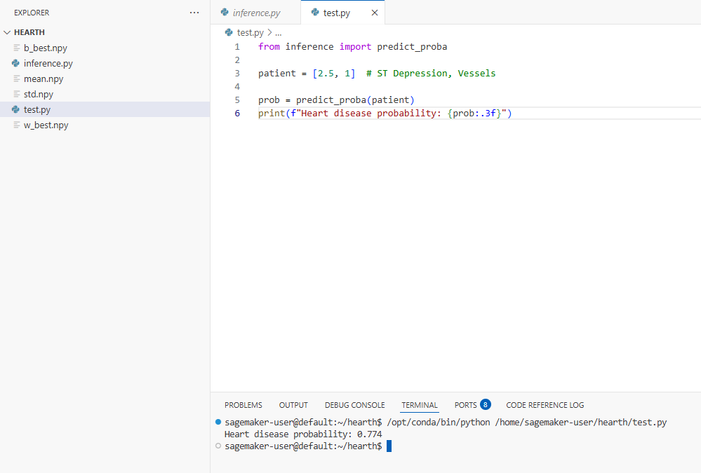

# Heart-Disease-Risk-Prediction

## Andrés Felipe Calderón Ramírez

## AWS SageMaker Execution Evidence 

## Summary:

This repository implements a complete logistic regression pipeline for heart disease prediction using the Kaggle Heart Disease dataset. 
The project covers the full machine learning workflow, including data exploration, preprocessing, model training from
scratch, regularization analysis, visualization, and deployment preparation.

## Dataset:

The dataset used in this project is the Heart Disease Dataset obtained from Kaggle. It contains 230 patient records, where each
instance represents clinical and demographic information collected for heart disease diagnosis.

### Dataset content:

* Age
* Sex
* Chest pain type
* Resting blood pressure (BP)
* Serum cholesterol (mg/dL)
* Fasting blood sugar
* Resting ECG results
* Maximum heart rate achieved
* Exercise-induced angina
* ST depression
* Slope of the ST segment
* Number of major vessels (fluoroscopy)
* Thallium test result
* Hearth Desease

The column selected was Hearth Desease which I mapped as:
Presence = 1 
Absence = 0

## Steps:

### Step 1 – Dataset Loading & Preparation

The Heart Disease dataset was obtained from Kaggle, a public platform for data science datasets
and machine learning projects. After downloading the CSV file, the data was loaded into a Pandas DataFrame.

Exploratory Data Analysis (EDA) was conducted to understand feature distributions, identify missing values or outliers, and
visualize the class distribution of the target variable.

For modeling, the data was split into training and test sets using a 70/30 stratified split to preserve class proportions.
Numerical features were normalized using mean–standard deviation scaling. At least six clinically relevant features were
selected, including Age, Cholesterol, Blood Pressure, Max Heart Rate, ST Depression, and Number of Vessels.

### Step 2 – Logistic Regression from Scratch

A binary logistic regression model was implemented from scratch using NumPy. This included defining the sigmoid activation
function, the binary cross-entropy cost function, and computing gradients for gradient descent optimization.

The model was trained on the full training dataset using a learning rate of approximately α = 0.01. 
The cost function was tracked and plotted against iterations to verify convergence. Model predictions were generated using a 0.5 probability threshold
and evaluated using accuracy, precision, recall, and F1-score on both training and test sets.

### Step 3 – Decision Boundary Visualization

To better understand feature separability, three two-dimensional feature pairs were selected:

* Age – Cholesterol
* Blood Pressure – Max Heart Rate
* ST Depression – Number of Vessels

For each pair, a logistic regression model was trained using only those two features. Decision boundaries were visualized alongside the
data points using scatter plots. These visualizations helped analyze linear separability and highlighted cases where non-linear
patterns limited model performance.

### Step 4 – Regularization & Hyperparameter Tuning

L2 regularization was added to the logistic regression model to reduce overfitting and control weight magnitude. The regularized
cost function and gradients included a penalty term proportional to the squared L2 norm of the weight vector.

Multiple regularization strengths were evaluated (λ = 0, 0.001, 0.01, 0.1, 1). For each λ value, the model was retrained
and evaluated. Cost curves and decision boundaries were re-plotted to compare unregularized and regularized models. Performance metrics
and the weight norm (‖w‖) were analyzed to select the most balanced model.

### Step 5 – Deployment Exploration with Amazon SageMaker

The best-performing logistic regression model was selected based on the F1-score. The trained model parameters (weights and bias) were
exported as NumPy arrays for deployment.

Amazon SageMaker Studio was explored to understand the deployment workflow. A notebook instance was created to upload and run
the training code. A simple inference script was designed to load the saved model and return heart disease probability predictions
for new patient inputs.

## Process in AWS:

1. I have started the lab in the AWS academy. 
2. I enter to sagemaker with the user we created in class.
3. In sagemaker I created a new code editor instance.

4. In the original git hub I exported the weight and bias form the model with the best score in F1-score.
5. In the editor I create a folder and drag the weight and bias.
6. I created a inference.py archive were I load the data.

7. In a test.py archive I test the model with a patient.

